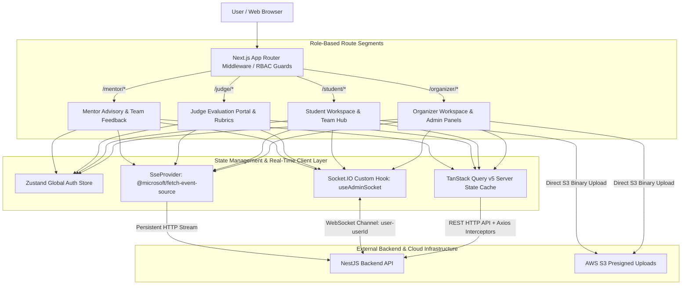

# 🎨 SEAL – Hackathon Management Platform (Frontend Client)

[](https://nextjs.org/)
[](https://react.dev/)
[](https://www.typescriptlang.org/)
[](https://tailwindcss.com/)
[](https://tanstack.com/query/v5)
[](https://socket.io/)
[](https://vitest.dev/)
[](LICENSE)

An ultra-modern, high-performance **Frontend Application** for **SEAL** (Software Engineering & AI-driven Hackathon Management Platform). Built on Next.js 16 App Router, React 18, Tailwind CSS v4, TanStack Query v5, Zustand, Socket.IO Client, and Server-Sent Events (SSE), this application delivers role-segmented workspaces, real-time data streaming, dark-mode glassmorphism aesthetics, and zero-latency optimistic UI updates.

---

## 📌 Project Overview & Value Proposition

Participating in and managing software engineering hackathons requires a responsive, intuitive interface tailored to specific user roles. **SEAL** provides 4 dedicated role-segmented workspaces:

1. 👑 **Organizers (`/organizer`):** Comprehensive event administration dashboards, competition track configuration, evaluation rubric setup, real-time round progress monitoring, bulk email execution, and inline round deadline editing with real-time countdown updates and past-date validation.
2. 🚀 **Students (`/student`):** Event registration, team formation, GitHub submission repository linking, real-time countdown timer tracking, and multi-round submission monitoring.
3. ⚖️ **Judges (`/judge`):** Streamlined scoring rubrics, independent team project evaluations, locked rubric score submissions, and real-time competition leaderboards.
4. 🛡️ **Mentors (`/mentor`):** Assigned team monitoring, advisory session scheduling, and structured team feedback management.

---

## 📐 Project Architecture & Structural Rationale

The application follows a **Feature-Driven App Router Architecture** leveraging Next.js React Server Components (RSC) for initial page layouts and Client Components for dynamic workspaces.



### Architectural Rationale: Why Feature-Driven App Router Pattern?

* **Strict Server/Client Boundary Separation**: React Server Components (RSC) render initial page shells on the server without shipping unnecessary JavaScript bundles to the browser. Interactive views (scoring forms, real-time chat, countdown timers) are isolated into Client Components (`"use client"`).
* **Isolated Role Workspaces & Edge RBAC Guards**: Route subtrees (`/organizer`, `/student`, `/judge`, `/mentor`) are encapsulated with dedicated layout wrappers and protected by Next.js Edge Middleware JWT role validation before page execution.
* **React 18 Compatibility Standard**: React is locked to `v18.3.1` (downgraded from React 19) to ensure 100% peer dependency stability with UI component packages (`@base-ui/react`, `notistack`, `framer-motion`) and eliminate type mismatch errors in `@types/react`.

---

## ⚡ Core Technical Features & Engineering Highlights

### 1. Hybrid Real-Time Integration (Socket.IO + Server-Sent Events)
* **Server-Sent Events (`SseProvider`)**: Uses `@microsoft/fetch-event-source` to maintain an auto-reconnecting HTTP stream for real-time system alerts and keep-alive heartbeats with automatic JWT header injection.
* **Socket.IO Real-Time Hook (`useAdminSocket`)**: Manages dynamic WebSocket connections isolated into user-specific rooms (`user-${userId}`, `admin-event-${eventId}`, `admin-round-${roundId}`).
* **Toast Notification Delivery**: Listens to `notification.new` socket events and renders `notistack` persistent toasts with click-to-dismiss capabilities.

### 2. State Management & In-Place Query Cache Updates
* **Dual-Tier State Model**: Uses **Zustand** for lightweight client-side global state (auth tokens, current user profile) and **TanStack Query v5** for server-state caching.
* **In-Place Query Cache Manipulation**: Executes `queryClient.setQueryData()` to update React Query cache in memory upon successful mutations (e.g. deadline extensions), enabling 0ms instant UI timer recalculations (`Time left`) without triggering full page reloads.
* **Deadline Past-Date Prevention Safeguard**: Inline deadline editor enforces HTML5 `min` attribute constraints matching `now` and validates inputs dynamically (`new Date(value) <= Date.now()`), disabling save actions if a past timestamp is selected.

### 3. Transparent Auth Refresh Interceptor
* **Axios Interceptor**: Traps `401 Unauthorized` responses, queues pending network requests, triggers silent token renewal via `HttpOnly Cookie`, and automatically retries queued requests invisibly to the user.

### 4. Direct AWS S3 Presigned Uploads
* Client uploads project submission artifacts by requesting short-lived presigned URLs from the Backend and issuing direct `PUT` uploads from the browser to AWS S3 buckets, bypassing backend payload bottlenecks.

---

## 🛠️ Complete Technology Stack

| Category | Technology | Version | Description |
| :--- | :--- | :--- | :--- |
| **Framework** | Next.js (App Router) | v16.2.6 | React framework with App Router, SSR, and RSC |
| **UI Core** | React & React DOM | v18.3.1 | Locked to React 18 for ecosystem library stability |
| **Language** | TypeScript | v5.x | Strongly-typed JavaScript superset |
| **Styling** | Tailwind CSS | v4.x | Utility-first CSS engine with PostCSS integration |
| **State Caching** | TanStack Query | v5.x | Server state management and in-memory cache mutation |
| **Global State** | Zustand | v4.x | Lightweight client-side authentication state store |
| **Real-Time** | Socket.IO Client & SSE | v4.8.3 | WebSockets and `@microsoft/fetch-event-source` |
| **Iconography & Animation**| Lucide React & Framer Motion| v1.16 / v12.x | Micro-animations and modern icons |
| **Toasts** | Notistack | v3.0.2 | Stackable toast notification system |
| **Testing** | Vitest | v3.0.4 | Fast Unit and Component test runner (`npm run test`) |

---

## 📂 Frontend Directory Structure

```
FE/
├── app/                        # Next.js 16 App Router Pages & Layouts
│   ├── (auth)/                 # Login, Register, Forgot Password routes
│   ├── admin/                  # System Admin Dashboard
│   ├── judge/                  # Judge Evaluation Workspaces & Leaderboards
│   ├── mentor/                 # Mentor Advisory & Team Feedback Hubs
│   ├── organizer/              # Event Organizer Management Panels & Round Workspaces
│   ├── student/                # Student Workspace & Team Submission Pages
│   └── layout.tsx              # Root Layout with Theme & Query Providers
├── components/                 # Reusable Component Library
│   ├── layout/                 # Navigation, Header, Topbar, Sidebar
│   ├── providers/              # React Query Provider, SseProvider, ThemeProvider
│   └── ui/                     # GlassCard, Button, Dialog, Tabs, Inputs
├── hooks/                      # Custom React Hooks (useAdminSocket, useSocket)
├── lib/                        # Axios instance, Auth Stores, Utility helpers
├── public/                     # Static Brand Assets & Images
│   ├── brand/                  # Logo emblems & brand identity files
│   └── images/                 # Architecture diagrams & static assets
├── services/                   # Modular API service helpers
├── package.json
└── README.md
```

---

## 🚀 Quick Start & Local Execution

### 1. Environment Setup
Create a `.env.local` file inside the `FE/` directory:
```env
NEXT_PUBLIC_API_BASE_URL=http://localhost:3000/api
```

### 2. Install Dependencies
```bash
cd FE
npm install
```

### 3. Run Development Server & Unit Tests
```bash
# Start frontend dev server
npm run dev

# Run frontend unit tests (Vitest)
npm run test
```

Open [http://localhost:3001](http://localhost:3001) in your browser to access the application.

---

## 📄 License
This module is licensed under the [MIT License](LICENSE).
