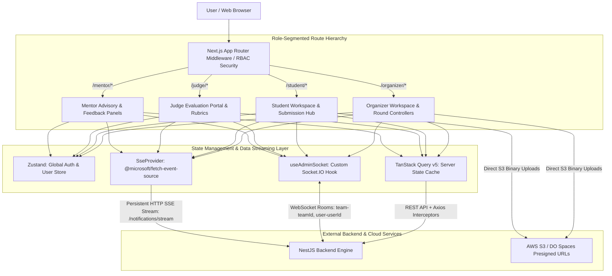

# 🎨 SEAL – Hackathon Management Platform (Frontend Client)

[](https://nextjs.org/)
[](https://react.dev/)
[](https://www.typescriptlang.org/)
[](https://tailwindcss.com/)
[](https://tanstack.com/query/v5)
[](https://socket.io/)
[](https://vitest.dev/)
[](LICENSE)

The **SEAL Frontend Client** is an ultra-modern, high-performance web application built with **Next.js 16 (App Router)**, **React 18**, **Tailwind CSS v4**, **TanStack Query v5**, **Zustand**, and **Socket.IO Client**. Designed specifically for software engineering hackathons, it delivers role-segmented workspaces, real-time live countdown updates, dark-mode glassmorphism aesthetics, AI-powered suggestion panels, and zero-latency optimistic UI interactions.

---

## 📌 Role-Based Workspaces & Value Proposition

The application partitions the hackathon lifecycle into 4 purpose-built, role-isolated workspaces:

```
                  ┌────────────────────────────────────────────────────────┐
                  │                 SEAL Frontend Client                   │
                  └──────────────────────────┬─────────────────────────────┘
                                             │
         ┌───────────────────┬───────────────┴───────────────┬───────────────────┐
         ▼                   ▼                               ▼                   ▼
  👑 /organizer       🚀 /student                     ⚖️ /judge           🛡️ /mentor
 ────────────────   ────────────────                ────────────────    ────────────────
 • Event Wizard     • Event Registration Flow       • Scoring Rubric    • Assigned Teams Hub
 • Track & Problem  • Team Formation & Invites      • Criteria Sliders  • Meeting Scheduling
 • Round Timers     • GitHub Repo Integration       • AI Score Suggest  • GitHub Analytics
 • Bulk Reminders   • Multi-Round Submissions       • Live Leaderboard  • AI Feedback Drafts
 • Analytics SSE    • Real-time Countdown Banner    • Locked Reviews    • Advisory Notes
```

1. 👑 **Organizer Workspace (`/organizer`):** Multi-step event creation wizards, competition tracks, problem statement pools, round countdown timer controllers, inline deadline editors with past-date validation, stakeholder assignment matrices, and real-time SSE analytics dashboards.
2. 🚀 **Student Workspace (`/student`):** Event registration flow, team formation with real-time invitation management, GitHub repository linking, submission artifact uploads, and live round countdown status banners.
3. ⚖️ **Judge Evaluation Portal (`/judge`):** Streamlined rubric evaluation forms, interactive criteria scoring sliders, AI-powered scoring suggestions, locked score review submissions, and live competition leaderboards.
4. 🛡️ **Mentor Advisory Hub (`/mentor`):** Assigned team workspaces, advisory session scheduling, team GitHub commit activity telemetry, and AI-assisted feedback drafting panels.
5. 🤖 **Global AI Assistant (`<SealAssistant />`):** Ubiquitous conversational AI widget resolving participant questions regarding rules, deadlines, submission guidelines, and event information in real-time.

---

## 📐 Frontend Architecture & Component Hierarchy

The application follows a **Feature-Driven App Router Architecture** combining React Server Components (RSC) for initial page layouts with Client Components for dynamic, interactive views.



### Architectural Principles

* **Server & Client Boundary Separation**: Static layouts, metadata, and initial page shells are rendered as React Server Components (RSC) to minimize JavaScript bundle sizes. Dynamic features (scoring sliders, chat windows, countdown timers) are cleanly isolated as Client Components (`"use client"`).
* **Zero-Latency In-Memory Query Mutation**: Utilizes `queryClient.setQueryData()` for optimistic updates upon mutations (e.g. extending round deadlines), instantly updating UI countdown timers across the application without requiring full page refetches.
* **Resilient Silent Token Refresh**: Configured with Axios response interceptors that intercept `401 Unauthorized` responses, queue pending requests, trigger silent token renewal via `HttpOnly Cookies`, and replay queued requests seamlessly.

---

## ⚡ Core Technical Features & Engineering Highlights

### 1. Hybrid Real-Time Architecture (Socket.IO + Server-Sent Events)
* **Server-Sent Events (`SseProvider`)**: Leverages `@microsoft/fetch-event-source` to maintain a persistent, auto-reconnecting HTTP event stream for instant organizer notifications, team registration alerts, and keep-alive heartbeats.
* **Socket.IO Real-Time Hook (`useAdminSocket`)**: Manages dynamic WebSocket connections isolated into granular room channels (`user-${userId}`, `team_${teamId}`, `admin-event-${eventId}`).
* **Toast Notification Delivery (`Notistack`)**: Listens to real-time events (`notification.new`) and renders dismissible, stacked toast notifications with action triggers.

### 2. Live Round Countdown Timers & Past-Date Protection
* **Real-time Countdown Engine**: Renders dynamic `Time left: DD:HH:MM:SS` countdown banners with color-coded urgency states (Green ➔ Amber ➔ Red).
* **Past-Date Validation Safeguard**: The inline deadline editor dynamically calculates HTML5 `min` constraints matching `Date.now()`, blocking submissions if past timestamps are selected and eliminating deadline corruption bugs.

### 3. AI-Assisted Evaluation & Feedback Panels
* **AI Rubric Suggestion (`<AiSuggestPanel />`)**: Analyzes student repository code and project artifacts to provide judges with automated scoring suggestions per rubric criterion.
* **AI Mentor Draft Assistant (`<AiMentorDraftPanel />`)**: Generates structured, constructive advisory feedback drafts for mentors to review, refine, and send to teams.

### 4. Direct Cloud Binary Uploads (AWS S3 Presigned URLs)
* Uploads large submission artifacts, slide decks, and avatars directly from the browser to cloud object storage using short-lived presigned URLs, bypassing backend bandwidth bottlenecks.

---

## 🛠️ Complete Frontend Technology Stack

| Category | Technology | Version | Purpose & Rationale |
| :--- | :--- | :--- | :--- |
| **Framework** | Next.js (App Router) | v16.2.6 | Full-stack React framework with App Router, SSR, and RSC. |
| **UI Library** | React & React DOM | v18.3.1 | Locked to React 18 for 100% peer dependency stability with UI ecosystems. |
| **Language** | TypeScript | v5.x | Type safety, typed API responses, and strict compiler checks. |
| **Styling** | Tailwind CSS | v4.x | Modern CSS engine with HSL theme tokens and glassmorphism styling. |
| **Server State** | TanStack Query | v5.x | Declarative server-state caching, background refetching, and in-place cache mutation. |
| **Client State** | Zustand | v4.x | Lightweight, boilerplate-free global client-side state management. |
| **Real-Time Stream** | Socket.IO Client & SSE | v4.8 / Fetch-Event-Source | Bi-directional WebSockets and auto-reconnecting Server-Sent Events. |
| **Notifications** | Notistack | v3.0.2 | Stackable toast notification system with custom action buttons. |
| **Icons & Motion** | Lucide React & Framer Motion | v1.16 / v12.x | High-quality icons and smooth micro-animations. |
| **Unit Testing** | Vitest & Testing Library | v3.0.4 | High-speed unit and component test runner. |

---

## 📂 Frontend Directory Structure

```
FE/
├── app/                        # Next.js 16 App Router Routes & Workspaces
│   ├── (auth)/                 # Authentication pages (Login, Register, Forgot Password)
│   ├── admin/                  # System Administrator Dashboard
│   ├── home/                   # Public Landing Page & Event Discovery Hub
│   ├── judge/                  # Judge Evaluation Workspaces & Rubric Scoring Portals
│   ├── mentor/                 # Mentor Advisory Hub & Team Feedback Workspaces
│   ├── organizer/              # Event Organizer Management Panels & Track Configurations
│   ├── student/                # Student Hub, Team Formation, & Submission Portals
│   ├── layout.tsx              # Root Layout with Theme, Query, and SSE Providers
│   └── globals.css             # Tailwind CSS v4 design tokens and glassmorphism utilities
├── components/                 # Reusable Component Architecture
│   ├── assistant/              # SEAL Conversational AI Assistant (<SealAssistant />)
│   ├── auth/                   # RoleGuard and Authentication boundary components
│   ├── github/                 # Event and Team GitHub Analytics dashboards & dialogs
│   ├── layout/                 # Topbar, Sidebar, Navigation headers per workspace
│   ├── providers/              # React Query Provider, SseProvider, ThemeProvider
│   ├── student/                # Countdown status banners & submission cards
│   └── ui/                     # GlassCard, Button, Dialog, Tabs, Form inputs
├── hooks/                      # Custom React Hooks (useAdminSocket, useSocket, useCountdown)
├── lib/                        # Axios instance with interceptors, Auth stores, Utilities
│   ├── api/                    # Modular API client services (judge, mentor, organizer, student)
│   ├── stores/                 # Zustand global stores (auth, theme)
│   └── utils/                  # Date formatting, score calculation, and string helpers
├── public/                     # Static brand identity assets and illustrations
├── Dockerfile                  # Multi-stage standalone production container build
├── package.json
└── tsconfig.json
```

---

## 🚀 Local Development Setup

### 1. Environment Configuration
Create a `.env.local` file inside the `FE/` directory:

```env
NEXT_PUBLIC_API_BASE_URL=http://localhost:3000/api
```

### 2. Install Dependencies
```bash
cd FE
npm install
```

### 3. Run Development Server
```bash
npm run dev
```
Open [http://localhost:3001](http://localhost:3001) in your browser to access the application.

### 4. Run Automated Tests
```bash
# Run unit & component tests with Vitest
npm run test

# Run tests in watch mode
npm run test:watch
```

### 5. Build for Production
```bash
npm run build
npm run start
```

---

## 📄 License

This frontend application is part of the SEAL Platform, licensed under the [MIT License](LICENSE).
