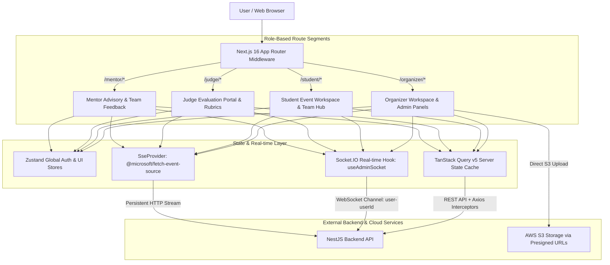

# 🎨 SEAL – Hackathon Management Platform (Frontend Client)

[](https://nextjs.org/)
[](https://react.dev/)
[](https://www.typescriptlang.org/)
[](https://tailwindcss.com/)
[](https://tanstack.com/query/v5)
[](https://zustand-demo.pmnd.rs/)
[](https://socket.io/)
[](LICENSE)

An ultra-modern, high-performance **Frontend Application** for **SEAL** (Software Engineering & AI-driven Hackathon Management Platform). Built on Next.js 16 App Router, React 19, TailwindCSS, TanStack Query v5, Zustand, Socket.IO, and Server-Sent Events (SSE), this application delivers role-segmented workspaces, real-time data streaming, dark-mode glassmorphism aesthetics, and zero-latency optimistic UI updates.

---

## 📌 Project Overview & Value Proposition

Organizing and participating in academic software engineering hackathons demands a clear, responsive, and intuitive interface for all stakeholders. **SEAL** provides custom role-tailored web interfaces designed specifically for 4 distinct user roles:

1. 👑 **Organizers (`/organizer`):** Access comprehensive event administration dashboards, manage competition tracks, configure evaluation rubrics, monitor round progress, execute bulk email notifications, and edit round submission deadlines inline with real-time countdown updates and past-date safeguards.
2. 🚀 **Students (`/student`):** Register for events, manage team rosters, link GitHub submission repositories, view live countdown timers, and track multi-round evaluation status.
3. ⚖️ **Judges (`/judge`):** Access streamlined scoring rubrics, evaluate team submissions independently, submit final score matrices, and monitor live competition leaderboards.
4. 🛡️ **Mentors (`/mentor`):** Oversee assigned hackathon teams, provide structured technical guidance, and manage advisory feedback sessions.

---

## 📐 System Architecture & Flow

The Frontend application adopts a **Feature-Driven Component Architecture** with clear separation of concerns between Server Components (RSC for static/initial data fetching) and Client Components (interactive dynamic views).



---

## ⚡ Core Technical Features & Engineering Highlights

### 1. Hybrid Real-Time Integration (WebSockets + SSE)
* **Server-Sent Events Provider (`SseProvider`):** Utilizes `@microsoft/fetch-event-source` to maintain a persistent, auto-reconnecting HTTP stream for real-time system alerts, server keep-alive heartbeats, and background task updates with automatic JWT header injection.
* **Socket.IO Real-Time Hook (`useAdminSocket`):** Manages dynamic WebSocket connections isolated into user-specific rooms (`user-${userId}`, `admin-event-${eventId}`, `admin-round-${roundId}`).
* **Click-to-Dismiss Toast Notifications:** Listens to `notification.new` events and renders custom `notistack` toasts with `persist: true` (persists until user click) and concise title formatting, while automatically refetching unread notification counts.

### 2. State Management, In-Place Cache Mutation & Date Validation
* **Dual-Tier State Architecture:** Uses **Zustand** for lightweight client-side global state (auth tokens, current user profile, theme state) and **TanStack Query v5** for server-side query management.
* **In-Place Query Cache Manipulation:** Executes `queryClient.setQueryData()` to update React Query cache in memory upon successful mutations (e.g. updating round submission deadline). Enables **0ms instant UI countdown timer recalculation** (`Time left`) without triggering full page reloads.
* **Deadline Past-Date Prevention Safeguard:** Inline deadline editor enforces HTML5 `min` attribute constraints matching `now` and validates inputs dynamically (`new Date(value) <= Date.now()`). Disables the Save action and displays dynamic warning alerts (`⚠️ Deadline must be set in the future.`) if a past timestamp is selected.

### 3. Silent Auth Refresh & Role-Based Route Protection (RBAC)
* **Transparent Token Refresh Interceptor:** Axios instance interceptor traps `401 Unauthorized` responses, queues pending network requests, triggers silent token renewal via `HttpOnly Cookie`, and automatically retries queued requests invisibly to the user.
* **Middleware Route Guards:** Next.js Middleware verifies user JWT roles (`Role.ORGANIZER`, `Role.STUDENT`, `Role.JUDGE`, `Role.MENTOR`) before rendering layout segments, preventing unauthorized route access at the edge level.

### 4. Direct Cloud Uploads (AWS S3 Presigned URLs)
* Uploads team project submission artifacts by requesting 5-minute signed Presigned URLs from the Backend and issuing direct `PUT` uploads from the browser to AWS S3 buckets. Eliminates backend payload bottlenecks.

### 5. Premium Aesthetics & Accessible UI Controls
* **Design System Tokens:** Custom HSL color palettes, subtle borders (`border-border`), and backdrop-blur glassmorphism effects (`GlassCard`) create a dark-mode luxury aesthetic.
* **Disabled State Safeguards & Tooltips:** Actions restricted by round status (e.g. Bulk Reminder or Deadline Editing when round status is not `open`) are visually disabled (`disabled:opacity-40`) and provide informative native hover tooltips in English.

---

## 🛠️ Technology Stack

| Category | Technology | Usage / Description |
| :--- | :--- | :--- |
| **Framework** | Next.js 16 (App Router) | Server-side rendering, RSC & route management |
| **UI Library** | React 19 | UI component model & hooks |
| **State Management** | TanStack Query v5 + Zustand | Server state caching & lightweight client state |
| **Styling** | TailwindCSS + Radix UI | Utility-first CSS & accessible unstyled primitives |
| **Real-time** | Socket.IO Client + SSE | WebSocket connections & Server-Sent Events |
| **Icons & Effects** | Lucide React + Framer Motion | Modern iconography & micro-animations |
| **Notifications** | Notistack | Stackable toast notification engine |

---

## 📂 Repository Directory Structure

```
FE/
├── app/                        # Next.js 16 App Router Pages & Layouts
│   ├── (auth)/                 # Login, Register, Password Reset routes
│   ├── admin/                  # System Admin Dashboard
│   ├── judge/                  # Judge Evaluation Workspaces & Leaderboards
│   ├── mentor/                 # Mentor Advisory & Team Feedback Hubs
│   ├── organizer/              # Event Organizer Management Panels & Round Workspaces
│   ├── student/                # Student Workspace & Team Submission Pages
│   └── layout.tsx              # Root Layout with Theme & Query Providers
├── components/                 # Reusable Component Library
│   ├── layout/                 # Topbar, Header, NotificationsMenu, Sidebar
│   ├── providers/              # React Query Provider, SseProvider, ThemeProvider
│   └── ui/                     # GlassCard, Button, Dialog, Tabs, Inputs
├── hooks/                      # Custom React Hooks (useAdminSocket, useSocket)
├── lib/                        # Axios instance, Auth Stores, Utility helpers
├── public/                     # Static Brand Assets & Images
│   ├── brand/                  # Logo emblems & brand identity files
│   └── images/                 # System architecture diagrams & static images
├── services/                   # Modular API service helpers
├── package.json
└── README.md
```

---

## 🚀 Quick Start & Installation

### Prerequisites
* Node.js v18+ or v20+
* Running NestJS Backend API (default `http://localhost:3000/api`)

### 1. Environment Setup
Create a `.env.local` file in the root directory:
```env
NEXT_PUBLIC_API_BASE_URL=http://localhost:3000/api
```

### 2. Install Dependencies
```bash
npm install
```

### 3. Run Development Server
```bash
npm run dev
```

Open [http://localhost:3001](http://localhost:3001) in your browser to view the application.

### 4. Build Production Bundle
```bash
npm run build
npm run start
```

---

## 📄 License
This project is licensed under the [MIT License](LICENSE).
