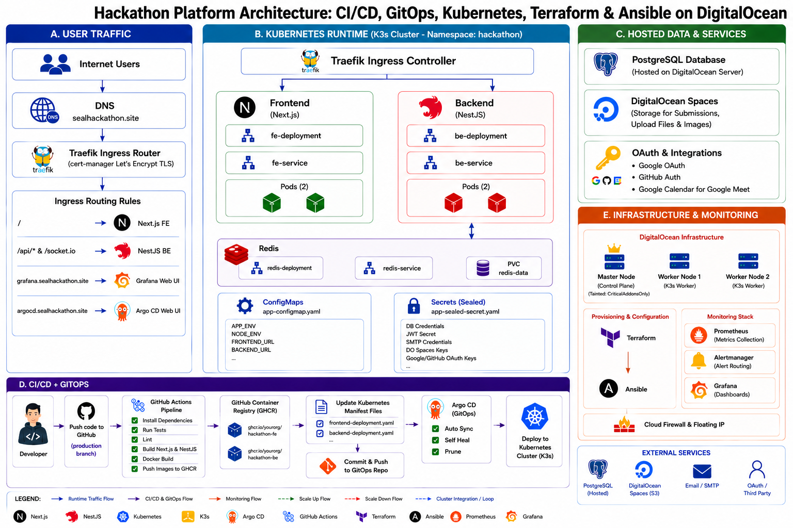

# 🛡️ SEAL – Software Engineering & AI-Driven Hackathon Management Platform

[](https://github.com/SEAL-WDP301/SEAL-WDP301-monorepo/actions)
[](https://k3s.io/)
[](https://argoproj.github.io/cd/)
[](https://nestjs.com/)
[](https://nextjs.org/)
[](https://www.postgresql.org/)
[](https://redis.io/)
[](LICENSE)

An enterprise-ready, production-grade monorepo platform designed to automate academic and software engineering hackathons at scale. SEAL integrates role-based management workspaces, real-time WebSocket state synchronization across scaled Kubernetes pods, pure event-driven delayed job scheduling, automated GitHub organization repository management, multi-judge rubric scoring, and Inter-Rater Reliability research telemetry.

---

## 📐 System Architecture & Infrastructure Topology

The infrastructure is deployed on a multi-node **Kubernetes (K3s)** cluster managed via **Terraform** and **Ansible** on DigitalOcean cloud infrastructure. Continuous Delivery is driven by **Argo CD (GitOps)** reconciled directly against declarative Kubernetes manifests stored in this repository.



### Core Architectural Layers

1. **Edge Router & Ingress Layer (Traefik Ingress + Let's Encrypt)**
   - Traefik Ingress Controller handles all incoming traffic for `sealhackathon.site`.
   - Automated TLS certificate provisioning and auto-renewal via `cert-manager` with Let's Encrypt ACME challenge integration.
   - Micro-routing: `/` routes to Frontend (Next.js), `/api/*` and `/socket.io/*` route to Backend (NestJS).

2. **Kubernetes Runtime Environment (K3s Cluster - Namespace: `hackathon`)**
   - **Backend Service (`be-deployment`)**: Scaled NestJS application pods (`replicas: 2+`) with readiness and liveness health probes (`/api/health`).
   - **Frontend Service (`fe-deployment`)**: Scaled Next.js App Router application pods (`replicas: 2+`).
   - **Redis Service (`redis-deployment`)**: High-performance in-memory datastore backed by Persistent Volume Claim (`redis-data`) for state sharing, distributed locking, and job queues.

3. **GitOps & Secret Management (`SealedSecrets` & `Argo CD`)**
   - **SealedSecrets Controller**: Asymmetrically encrypts local secrets (`app-secret.yaml` ➔ `app-sealed-secret.yaml`) using a cluster public key. Only the in-cluster `sealed-secrets-controller` (running in `kube-system`) holds the private key to decrypt secrets into native Kubernetes `Secret` objects.
   - **Argo CD Operator**: Runs inside the cluster, continuously monitoring `k8s/base` manifests on the `production` branch. Enforces `Auto-Sync`, `Self-Healing`, and automated pruning of out-of-sync resources.

---

## ⚡ Key Engineering Solutions & Architecture Highlights

### 1. Multi-Pod Real-Time WebSocket Synchronization (`RedisIoAdapter`)
- **Problem**: In a scaled Kubernetes cluster with multiple Backend pods (`replicas: 2+`), clients connected via WebSockets to different pods cannot receive real-time events emitted by another pod.
- **Solution**: Implemented a custom `RedisIoAdapter` extending NestJS `IoAdapter` backed by `@socket.io/redis-adapter` over Redis Pub/Sub channels. When any backend pod emits a Socket.IO event (e.g., `feedback_updated` or `notification.new`), it is published to Redis and instantly broadcasted to all active backend replicas, enabling seamless cross-pod real-time synchronization without sticky sessions.

### 2. Pure Event-Driven Delayed Job Scheduling (Zero DB Polling)
- **Problem**: Polling relational databases for round deadlines or bulk email reminders degrades query performance and increases CPU load.
- **Solution**: Built a pure event-driven queue engine using **BullMQ** and **Redis Sorted Sets (ZSET)**. Round closure timers and reminder jobs are indexed by exact millisecond execution timestamp (`score = timestamp`). When round deadlines are extended, existing delayed jobs are dynamically removed and re-indexed in Redis with zero database query overhead.

### 3. Automated GitOps CI/CD Pipeline with Fail-Fast Gates
- **`dev` Branch Workflow**: Triggers parallel Backend and Frontend TypeCheck (`npx tsc --noEmit`) and Unit Test execution (`jest` / `vitest`). Fast-fails on syntax or logic errors in 30–40 seconds without container build overhead.
- **`production` Branch Workflow**: Runs quality gates ➔ Compiles parallel Docker images ➔ Pushes tagged images (`ghcr.io/seal-wdp301/be` & `fe`) to GitHub Container Registry ➔ Mutates manifest image tags in `k8s/base/` ➔ Pushes manifest updates back to Git with `[skip ci]` ➔ Triggers Argo CD zero-downtime rolling update rollout.

---

## 🛠️ Technology Stack Matrix

| Layer | Technology | Version / Tooling | Rationale & Function |
| :--- | :--- | :--- | :--- |
| **Backend Core** | NestJS / Node.js | v10.4 / Node 20 | Modular Monolith framework with TypeScript, dependency injection, and clean layering. |
| **Database & ORM** | PostgreSQL & Prisma ORM | Postgres 16 / Prisma 6.19 | Relational storage with type-safe schema migrations and automated TS client generation. |
| **Caching & Messaging**| Redis & BullMQ | Redis 7 / BullMQ 5.81 | In-memory key-value cache, distributed locks, BullMQ delayed queues, and Socket.IO Pub/Sub adapter. |
| **Real-Time Stream** | Socket.IO & SSE | Socket.IO 4.8 / RxJS SSE | Bidirectional WebSockets for interactive workspaces; HTTP SSE streams for system alerts. |
| **Frontend Core** | Next.js & React | Next.js 16.2 / React 18.3 | App Router with React Server Components, client workspaces, and role-based middleware guards. |
| **Styling & State** | Tailwind CSS & TanStack Query| Tailwind v4 / React Query v5 | Utility-first styling with HSL tokens, dark-mode glassmorphism UI, and server-state caching. |
| **Infrastructure** | K3s & DigitalOcean | K3s v1.28+ / DO Compute | Lightweight CNCF-certified Kubernetes cluster hosted on DigitalOcean virtual machines. |
| **GitOps & Deployment**| Argo CD & SealedSecrets | Argo CD v2.10+ / Bitnami | Continuous deployment operator and asymmetric secret encryption for Git-committed manifests. |
| **IaC & Provisioning** | Terraform & Ansible | Terraform 1.7 / Ansible 2.15 | Infrastructure-as-Code for DigitalOcean droplet provisioning and automated K3s cluster setup. |

---

## 🔄 CI/CD & GitOps Execution Workflow

```
[ Developer Push / PR ]
         │
         ├──► Branch: 'dev' ─────────► [ Parallel Quality Gate ]
         ├──► PR Branch: 'production'─>├── BE: npx tsc --noEmit + npm run test
         │                             └── FE: npx tsc --noEmit + npm run test
         │                             └── ❌ Fail: Block Merge | ✅ Pass: Complete (<40s)
         │
         └──► Branch: 'production' ──► [ Parallel Quality Gate ]
                                       │   └── (Must Pass 100%)
                                       ▼
                                [ Build & Push Docker Images ] ──► GitHub Container Registry (GHCR)
                                       │
                                       ▼
                                [ Update K8s Manifest Image Tags ]
                                       │   └── Commit & Push to Git [skip ci]
                                       ▼
                                [ Argo CD GitOps Operator ]
                                       │   └── Reconcile Manifests (Auto-Sync & Self-Healing)
                                       ▼
                                [ K3s Kubernetes Cluster ] ──► Zero-Downtime Rolling Update Rollout

---

## 📂 Repository Structure

```
SEAL-WDP301-monorepo/
├── .github/
│   └── workflows/ci-cd.yml    # GitHub Actions dual-branch CI/CD pipeline definition
├── BE/                        # NestJS Backend API Engine (Prisma, Redis, BullMQ, Socket.IO)
├── FE/                        # Next.js 16 App Router Frontend Client (Tailwind v4, React Query)
├── infrastructure/            # Infrastructure-as-Code
│   ├── ansible/               # Ansible playbooks for K3s & Argo CD provisioning
│   └── terraform/             # Terraform scripts for DigitalOcean droplets & DNS
├── k8s/                       # Declarative Kubernetes Manifests
│   ├── argocd/                # Argo CD Application CRD definitions
│   └── base/                  # Deployments, Services, ConfigMaps, and SealedSecrets
└── README.md                  # System-wide Root Architecture Documentation
```

---

## 📄 License

This repository is licensed under the [MIT License](LICENSE).
